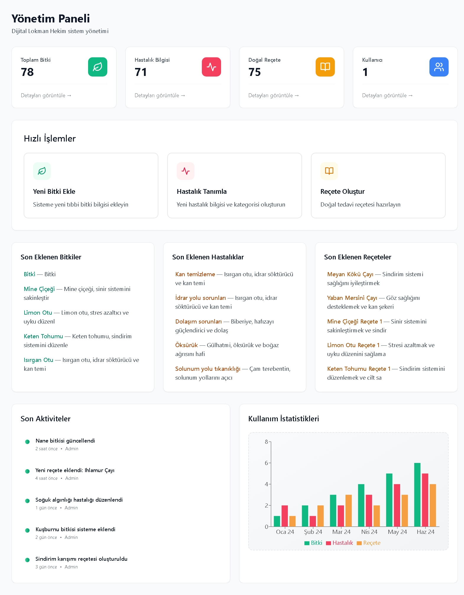
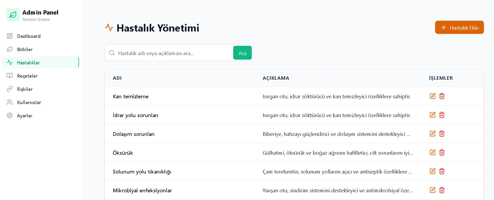
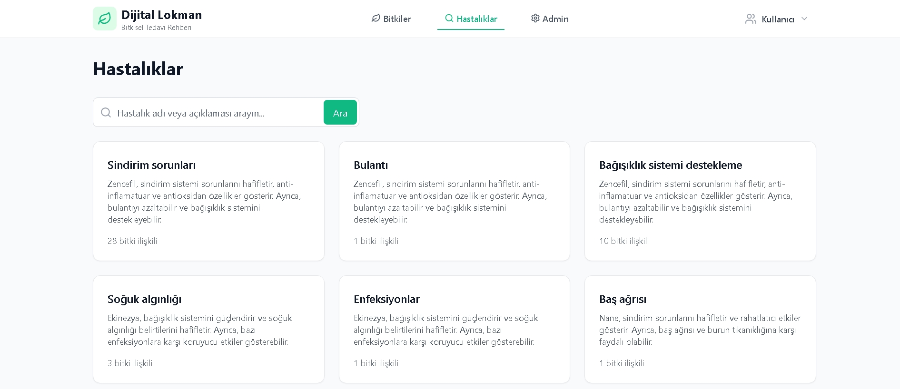
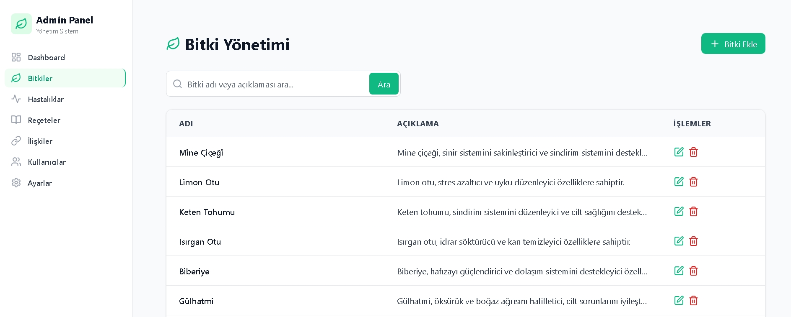
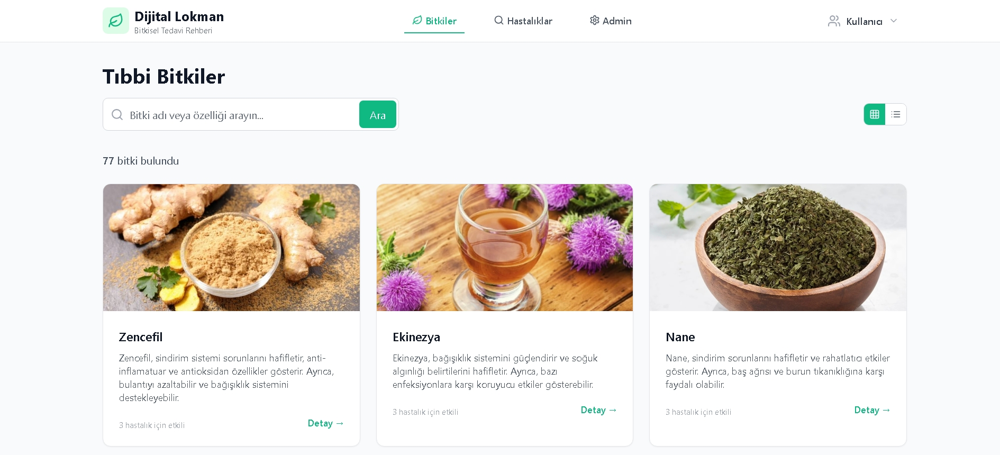
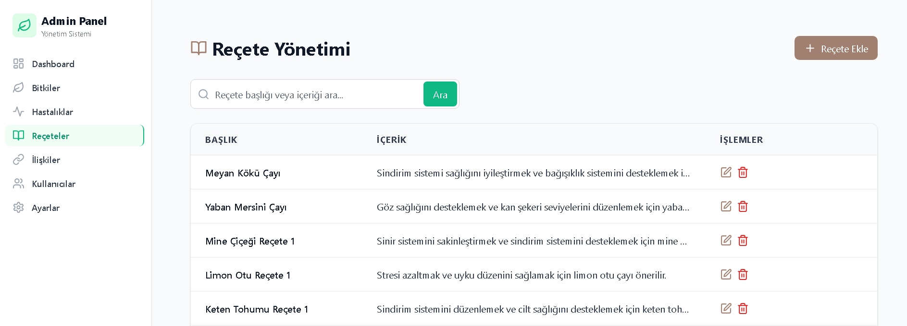
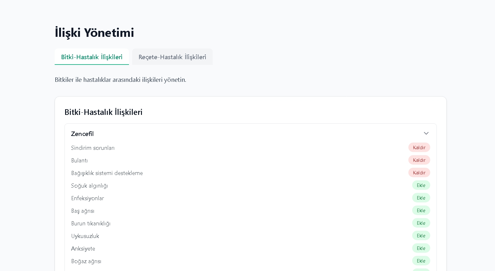

# Dijital Lokman Hekim

> **Doğal Sağlık, Akıllı Rehber!**

---

## Açıklama / Proje Tanıtımı

Dijital Lokman Hekim, bitkisel tedavi ve doğal sağlık alanında kullanıcıların bitki, hastalık ve reçete bilgilerine kolayca ulaşmasını sağlayan modern bir web uygulamasıdır. Yönetim paneli ile içerik yönetimi, akıllı sohbet asistanı ile kullanıcıya rehberlik ve otomatik anahtar kelime geliştirme gibi yenilikçi özellikler sunar.

---

## Özellikler (Features)

- **Modern Yönetim Paneli:** Bitki, hastalık, reçete ve ilişkileri kolayca yönetin.
- **Akıllı Sohbet Asistanı:** Gemini API ile Türkçe sağlık ifadelerini anlayıp yönlendirme.
- **Otomatik Keywords Geliştirme:** Kullanıcıdan gelen yeni ifadeler otomatik olarak hastalık keywords alanına eklenir.
- **Kapsamlı Anahtar Kelime Yönetimi:** Fuzzy search ile akıllı eşleşme.
- **Kullanıcı Dostu Arayüz:** Responsive, sade ve mobil uyumlu tasarım.

---

## Kurulum (Installation)

1. **Projeyi klonlayın:**
   ```bash
   git clone <repo-link>
   cd Herbal
   ```
2. **Bağımlılıkları yükleyin:**
   ```bash
   cd backend && npm install
   cd ../frontend && npm install
   ```
3. **Ortam değişkenlerini ayarlayın:**
   - `.env` dosyasına Gemini API anahtarınızı ve MongoDB bağlantınızı ekleyin.
4. **Backend'i başlatın:**
   ```bash
   cd backend
   npm start
   ```
5. **Frontend'i başlatın:**
   ```bash
   cd ../frontend
   npm run dev
   ```

> **Desteklenen Sistemler:** Windows, macOS, Linux

---

## Kullanım (Usage)

- Yönetim paneline admin olarak giriş yapın.
- Bitki, hastalık, reçete ekleyin ve ilişkileri yönetin.
- Sohbet asistanını kullanarak doğal sağlık önerileri alın.

---

## Ekran Görüntüleri

### Yönetim Paneli



### Hastalıklar Sayfası




### Bitkiler Sayfası




### Reçeteler ve İlişkiler




---

## Yapı / Teknolojiler

- **Frontend:** React, TypeScript, TailwindCSS, Vite
- **Backend:** Node.js, Express.js
- **Veritabanı:** MongoDB
- **AI Entegrasyonu:** Gemini API (Google)
- **Diğer:** Fuse.js (fuzzy search)

---

## Katkıda Bulunma (Contributing)

Katkı sağlamak için:

1. Fork'la
2. Yeni bir branch oluştur
3. Değişikliklerini yap ve commit et
4. Pull request gönder

Her türlü katkı ve geri bildirim memnuniyetle karşılanır!

---

## Lisans (License)

MIT Lisansı

---

## Yazar(lar) / İletişim

- **GitHub:**(https://github.com/Aliburus)

> **Not:** Bu uygulama sadece bilgilendirme amaçlıdır. Tıbbi tavsiye için mutlaka uzman doktorunuza danışınız.
